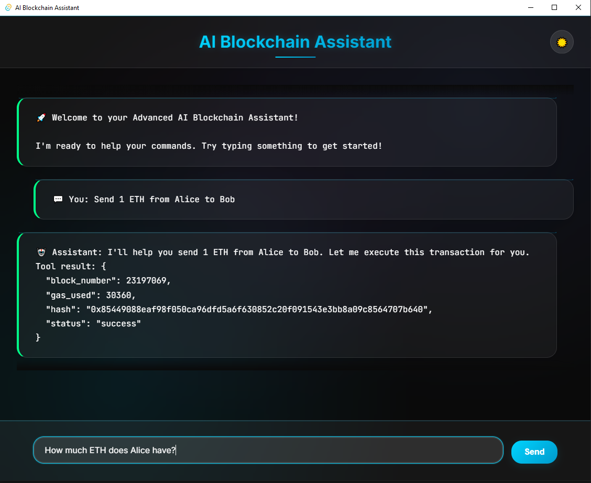

<h1 align="center">AI + Blockchain + Rust <br/> Smart Assistant</h1>

<p align="center">
  <b>🚀 Next-gen AI assistant for Ethereum blockchain: natural language, RAG, MCP and a beautiful chat UI.</b><br>
</p>

---

AI Blockchain Assistant is a comprehensive system for interacting with Ethereum using natural language. It features:

- 🤖 **AI-powered CLI and Desktop Chat UI** (Tauri + React)
- 📚 **RAG Knowledge Base** (Retrieval-Augmented Generation)
- 🔗 **Blockchain operations** (ETH transfers, token swaps, contract queries)
- 🌐 **External API integrations** (DefiLlama, Brave Search, 0x)

---

## 📂 Project Structure

```
ai-blockchain-assistant/
├── crates/         # All Rust and frontend code
│   ├── chatapp/    # Tauri + React chat UI
│   ├── mcp-server/ # Main MCP server (Rust)
│   ├── rig-client/ # CLI client (Rust)
│   └── shared/     # Shared Rust code
├── data/           # Blockchain docs, ABIs, embeddings for RAG
│   ├── docs/       # Markdown, Solidity, Uniswap docs
│   └── embeddings/ # Vector embeddings
├── scripts/        # Shell scripts for setup and running
│   ├── populate_rag.sh # Populate RAG with docs
│   ├── run_app.sh      # Run the Tauri app
│   └── run_repl.sh     # Run the CLI REPL
└── ...
```

---

## 🏗️ Architecture

```
User (CLI/Chat UI)
      ↓
RIG Client (Rust CLI) / Tauri Chat UI (React)
      ↓
MCP Server (Rust, LLM, RAG)
      ↓
Forked Ethereum (Anvil, Foundry)
      ↑
RAG Knowledge Base (Markdown, Solidity, Uniswap)
```

---

## ✨ Features

- Natural language blockchain commands (ETH, ERC20, Uniswap, etc)
- RAG-powered answers for blockchain concepts
- Token swaps, contract queries, and more
- CLI and beautiful desktop chat UI
- External API integrations
- Test accounts and local mainnet fork

---

## ⚡ Quick Start

### 1. Prerequisites

- Rust & Cargo
- Node.js & npm (for chat UI)
- Foundry (auto-installed by scripts)
- Anthropic API key

### 2. Setup

Clone and enter the repo:

```bash
git clone https://github.com/superdev947/ai-blockchain-assistant.git
cd ai-blockchain-assistant
```

Set your Anthropic API key:

```bash
export ANTHROPIC_API_KEY="your_api_key_here"
```

#### (A) Run the CLI REPL

```bash
chmod +x scripts/run_repl.sh
./scripts/run_repl.sh
```

#### (B) Run the Chat UI (Tauri + React)

```bash
cargo install tauri-cli
cd crates/chatapp
npm install
```

then

```bash
chmod +x scripts/run_app.sh
./scripts/run_app.sh
```

#### (C) Populate RAG with docs

```bash
chmod +x scripts/populate_rag.sh
./scripts/populate_rag.sh
```

---

## 🖥️ Screenshots

<p align="center">
  
  <br>
  <i>Modern, animated chat interface for your blockchain assistant</i>
</p>

---

## 🤖 Usage Examples

### CLI

```
> send 1 ETH from Alice to Bob
> How much USDC does Alice have?
> Is Uniswap V2 Router (0x7a250d5630B4cF539739dF2C5dAcb4c659F2488D) deployed?
> Swap 10 ETH for USDC on Alice's account
> Explain how Uniswap V2 works
> What are the key functions in the ERC-20 standard?
```

### Chat UI

Type your question or command in the chat window and get instant, AI-powered answers and blockchain actions.

---

## 🧠 RAG System

The RAG (Retrieval-Augmented Generation) system enhances the AI assistant with knowledge about:

- Ethereum basics and concepts
- Token standards (ERC-20, ERC-721)
- Uniswap V2 and V3 protocols
- Smart contract interfaces

---

## 🧪 Test Accounts

The system uses Anvil's default test accounts:

- **Alice**: `0xf39Fd6e51aad88F6F4ce6aB8827279cffFb92266`
- **Bob**: `0x70997970C51812dc3A010C7d01b50e0d17dc79C8`

Each account comes with 10,000 ETH for testing.

---

## 🛠️ Scripts

- `scripts/populate_rag.sh` — Populate the RAG system with blockchain docs
- `scripts/run_app.sh` — Run the Tauri chat UI
- `scripts/run_repl.sh` — Run the CLI REPL

---

## 🤝 Contributing

Contributions, bug reports, and feature requests are welcome! Please open an issue or submit a pull request.

---
